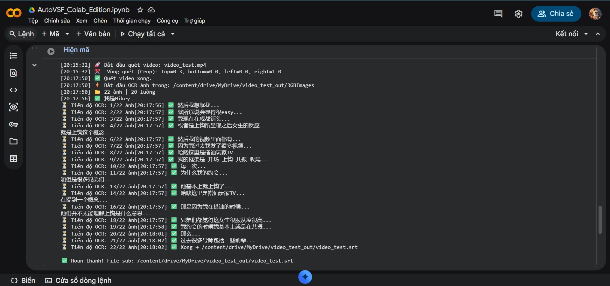

# AutoVSF - Google Colab Edition

> 🌐 **[Tiếng Việt](docs/VIE_README.md)** | **[中文](docs/CN_README.md)**

Automated hard subtitle (hardsub) extraction tool using VideoSubFinder and Google Drive OCR. This edition is specifically optimized to run persistently on Google Drive.

🔗 **Main Edition (Codespaces):** 
🔗 **Colab Edition:** 

---

## 🚀 Quick Start

1. **Open the Notebook:** Open `AutoVSF_Colab_Edition.ipynb` with Google Colab.
2. **Mount Drive:** Run the first cell to connect to your Google Drive.
3. **Configure:** Upload your `credentials.json` file to the `AutoVSF/autovsf-colab/` folder on Drive.
4. **Run Setup:** Execute the setup cell. The script will automatically fix library compatibility issues for Ubuntu 22.04.
5. **Extract:** Enter the video path and start processing.

## 📸 Screenshots

  

## 🌟 Colab Edition Advantages
- **No data loss:** The entire tool and all results are saved on Drive.
- **Time-saving:** VideoSubFinder is downloaded only once.
- **Auto-fix:** Comprehensive handling of missing libraries on fresh Colab environments.

## ⚠️ Notes
- Always keep your `credentials.json` file secure.
- After processing, clean up temporary image folders to avoid filling up your Drive quota.

## 📚 Docs
- [install.sh Explanation](docs/install-explanation.md)
